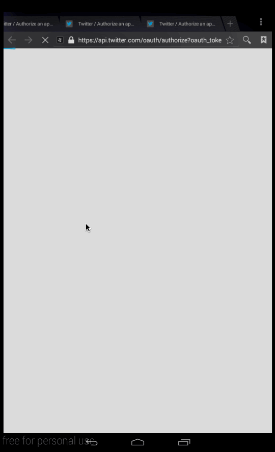

# Project 3 - Simple Tweets

Simple Tweets is an android app that allows a user to view his Twitter timeline and post a new tweet. The app utilizes [Twitter REST API](https://dev.twitter.com/rest/public).

Time spent: 5 hours spent in total

## Related Work
This project is the fourth in a series for [CodePath's Android Mobile Bootcamp for Engineers](http://codepath.com/androidbootcamp)

1. **[SimpleTodo](https://github.com/kristeaac/codepath-project-0-todo)** - allows building a todo list with basic todo items management functionality including adding new items, editing and deleting an existing item
2. **[Instagram Photo Viewer](https://github.com/kristeaac/codepath-project-1-instagram-photo-viewer)** - read-only media viewer for Instagram which allows a user to check out popular photos and videos 
3. **[Google Image Search](https://github.com/kristeaac/codepath-project-2-google-image-search)** - a Google Image Search app which allows a user to select search filters and paginate results infinitely
4. **Simple Tweets** - a simple Twitter client that supports viewing a Twitter timeline and composing a new tweet
5. **[Extended Simple Tweets](https://github.com/kristeaac/codepath-project-4-extended-twitter-client)** - an extension of the previous Twitter client to use a tabbed interface and fragments

## User Stories

The following **required** functionality is completed:

* [X]	User can **sign in to Twitter** using OAuth login
* [X]	User can **view tweets from their home timeline**
  * [X] User is displayed the username, name, and body for each tweet
  * [X] User is displayed the [relative timestamp](https://gist.github.com/nesquena/f786232f5ef72f6e10a7) for each tweet "8m", "7h"
  * [X] User can view more tweets as they scroll with [infinite pagination](http://guides.codepath.com/android/Endless-Scrolling-with-AdapterViews). Number of tweets is unlimited.
    However there are [Twitter Api Rate Limits](https://dev.twitter.com/rest/public/rate-limiting) in place.
* [X] User can **compose and post a new tweet**
  * [X] User can click a “Compose” icon
  * [X] User can then enter a new tweet and post this to twitter
  * [X] User is taken back to home timeline with **new tweet visible** in timeline

The following **optional** features are implemented:

* [X] User can **see a counter with total number of characters left for tweet** on compose tweet page
* [X] User can **click a link within a tweet body** on tweet details view. The click will launch the web browser with relevant page opened.
* [X] User can **pull down to refresh tweets timeline**
* [ ] User can **open the twitter app offline and see last loaded tweets**. Persisted in SQLite tweets are refreshed on every application launch. While "live data" is displayed when app can get it from Twitter API, it is also saved for use in offline mode.
* [X] User can tap a tweet to **open a detailed tweet view**
* [X] User can **select "reply" from detail view to respond to a tweet**
* [X] Improve the user interface and theme the app to feel "twitter branded"

The following **bonus** features are implemented:

* [X] User can see embedded image media within the tweet detail view
* [X] Compose tweet functionality is build using modal overlay

The following **additional** features are implemented:

* [X] "Compose" new tweet icon is a floating action button on the timeline
* [X] User can retweet on tweet details view
* [X] User can favorite and unfavorite on tweet details view

## Video Walkthrough 

Here's a walkthrough of implemented user stories:



GIF created with [LiceCap](http://www.cockos.com/licecap/).

## Notes

### Clicking links in ListViews resulted in a runtime exception

After enabling autolink, I was receiving the following error when clicking on any tweets with links inside the timeline's ListView:
 
 ```ERROR/AndroidRuntime(7557): java.lang.RuntimeException: Unable to start receiver com.wcc.Wakeup: android.util.AndroidRuntimeException: Calling startActivity() from outside of an Activity context requires the FLAG_ACTIVITY_NEW_TASK flag. Is this really what you want?```

The solution was simple. I needed to instantiate the ListView's adapter with a reference to the main activity, not the application context.


## Open-source libraries used

- [Android Async HTTP](https://github.com/loopj/android-async-http) - Simple asynchronous HTTP requests with JSON parsing
- [Picasso](http://square.github.io/picasso/) - Image loading and caching library for Android
- [Jackson](https://github.com/FasterXML/jackson) - JSON parser
- [PrettyTime](https://github.com/ocpsoft/prettytime/) - Social style date and time formatting
- [RoundedImageView](https://github.com/vinc3m1/RoundedImageView) - An ImageView that supports rounded corners

## License

    Copyright 2015 Kristy Caster

    Licensed under the Apache License, Version 2.0 (the "License");
    you may not use this file except in compliance with the License.
    You may obtain a copy of the License at

        http://www.apache.org/licenses/LICENSE-2.0

    Unless required by applicable law or agreed to in writing, software
    distributed under the License is distributed on an "AS IS" BASIS,
    WITHOUT WARRANTIES OR CONDITIONS OF ANY KIND, either express or implied.
    See the License for the specific language governing permissions and
    limitations under the License.